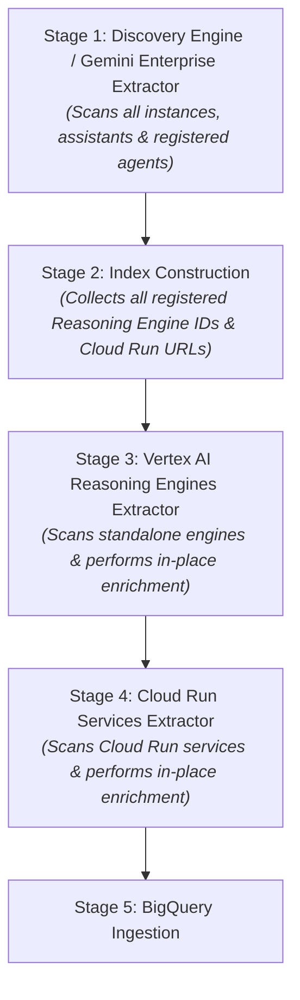

# Extractor Architecture & Execution Flow

This document details the multi-stage execution pipeline, deduplication strategy, and in-place record enrichment logic implemented in `ge_agent_extractor`.

---

## 🏗️ Multi-Stage Execution Pipeline

The extractor operates in a strict, synchronous 5-stage pipeline to guarantee data completeness and avoid duplicate rows in BigQuery.

---

## 🔄 Execution Order & Guaranteed Reading Sequence

It is **guaranteed** that the extractor reads all Gemini Enterprise instances and their registered agents **prior** to inspecting standalone Vertex AI Reasoning Engines or Cloud Run services:

1. **Stage 1 — Discovery Engine Scanning (`extract_discovery_engine_agents`)**:
   - Queries Discovery Engine across all supported locations (`global`, `us`, `eu`).
   - Retrieves top-level Gemini Enterprise app instances (`App Engine`) as well as all registered sub-agents (`/assistants/.../agents`) under each instance.
   - Captures organizational metadata: Gemini Enterprise instance names, `author_email`, IAM permissions, `sharingConfig`, and access scopes.

2. **Stage 2 — Index Construction**:
   - Iterates through the baseline records from Stage 1 (`de_agents`).
   - Builds in-memory lookup sets:
     - `registered_re_ids`: Resource paths of Reasoning Engines registered under Gemini Enterprise (e.g. `projects/.../reasoningEngines/...`).
     - `registered_cr_urls`: Endpoint URLs of A2A / Cloud Run services registered under Gemini Enterprise.

3. **Stage 3 — Vertex AI Reasoning Engine Extraction & In-Place Enrichment**:
   - Queries Vertex AI Reasoning Engines (`aiplatform.reasoningEngines`) across all configured GCP regions (`us-central1`, `us-east1`, `us-west1`, `europe-west1`, etc.).
   - **Enrichment & Deduplication Logic**:
     - **If registered in Gemini Enterprise**: The standalone Reasoning Engine is skipped to prevent duplicate rows. All deep technical execution metadata (pickle GCS URI, `requirements.txt` GCS URI, Python runtime version, service account, query REST endpoints) is automatically merged **in-place** into the existing Gemini Enterprise registered agent record.
     - **If NOT registered in Gemini Enterprise**: The Reasoning Engine is appended as a new standalone `Agent Runtime` record.

4. **Stage 4 — Cloud Run Services Extraction & In-Place Enrichment**:
   - Queries Cloud Run container services (`run.services`) and inspects A2A cards (`/.well-known/agent-card.json`).
   - **Enrichment & Deduplication Logic**:
     - **If registered in Gemini Enterprise**: The standalone Cloud Run service is skipped, and container metadata (`cloud_run_image`, `cloud_run_region`, `cloud_run_service_account`, `a2a_skills`, etc.) is merged **in-place** into the registered agent record.
     - **If NOT registered in Gemini Enterprise**: The service is appended as a new standalone `Cloud Run (A2A)` record.

5. **Stage 5 — BigQuery Ingestion**:
   - Assigns an incremental `collection_id` (`INT64`, e.g., `1`, `2`, `3`) and `collection_timestamp`.
   - Performs a schema-validated batch load (`load_table_from_json`) into `ge_agent_inventory.agent_details`.

---

## 🎯 Benefits of In-Place Record Enrichment

- **Single Source of Truth**: Agents deployed into Gemini Enterprise instances retain their enterprise context (instance name, sharing policy, author email) while acquiring deep code/container execution details.
- **Zero Duplicate Rows**: Standalone Reasoning Engines and Cloud Run services that back registered Gemini Enterprise agents are deduplicated without losing technical metadata.
- **Complete Feature Flags**: Fields such as `python_version`, `pickle_object_gcs_uri`, `cloud_run_image`, and runtime service accounts are populated across both registered and standalone agents.
