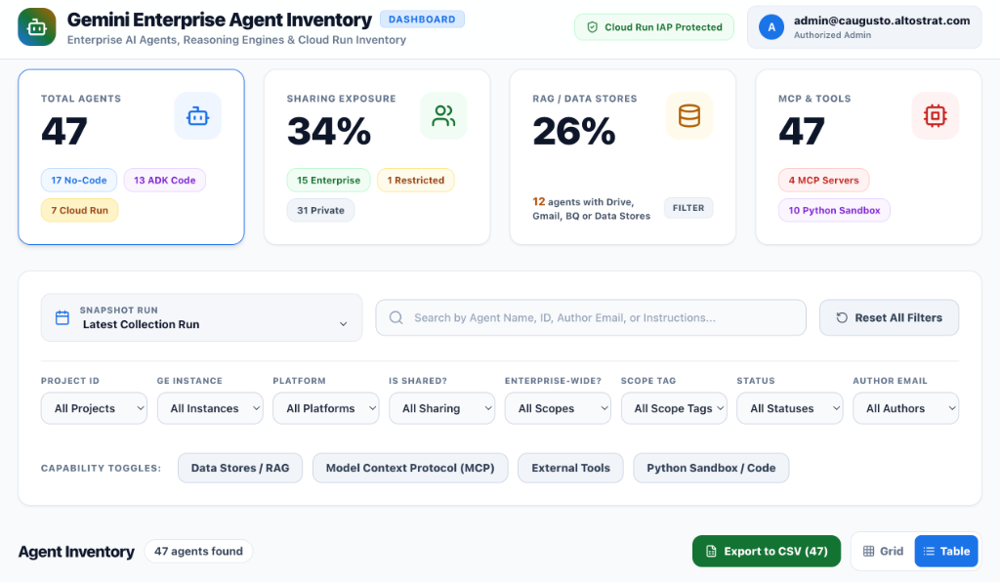
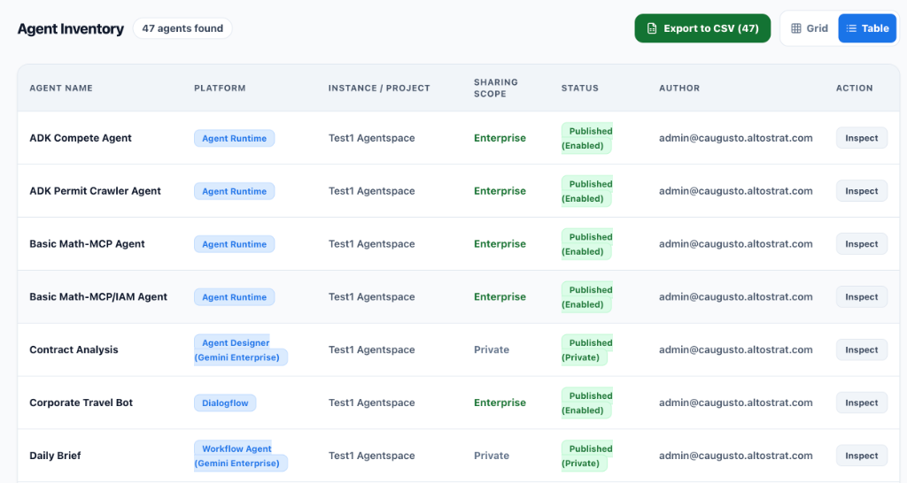
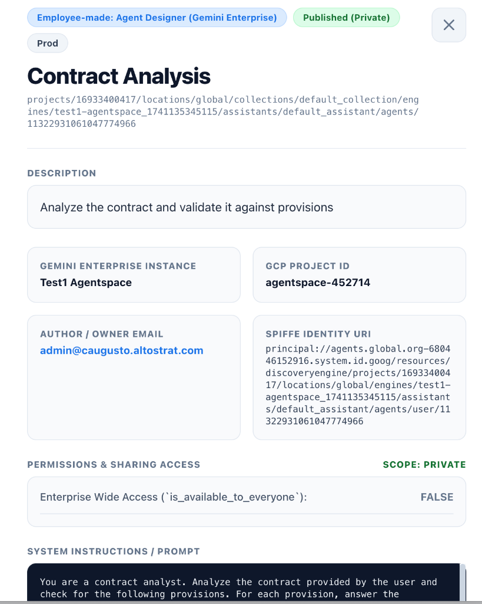
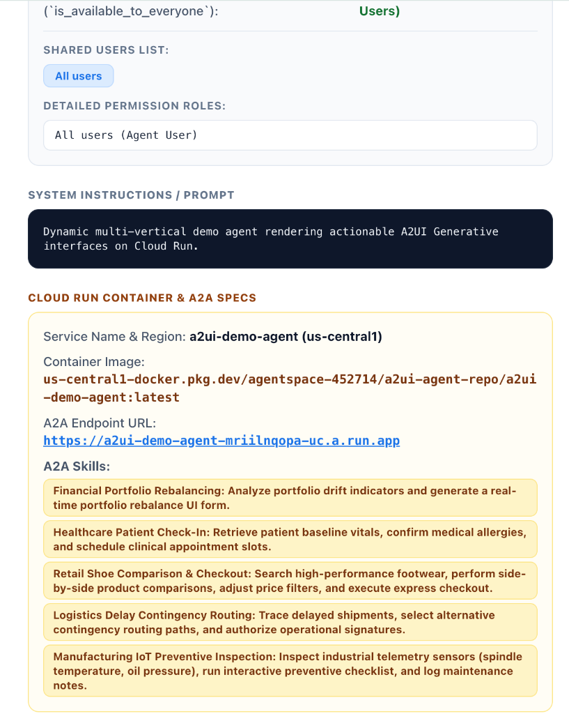

# Gemini Enterprise Agent Inventory Dashboard App

A bespoke, high-performance **React + FastAPI Web Application** that visualizes the BigQuery Agent Inventory (`ge_agent_inventory.agent_details`), providing overall computational metrics, multi-dimensional filtering, interactive KPI stat toggles, mouse-hover term definitions, full CSV export, and 360-degree agent detail drill-downs.

---

## 📸 Dashboard Screenshots & Visual Interface

### 1. Overview & Computational Summary Header


*Interactive KPI Summary Stat Cards, Snapshot Run selector, Multi-Select filters (`Is Shared?`, `Enterprise-Wide?`, `Project ID`, `Platform`), Capability toggles, and Global Search.*

---

### 2. Tabular Inventory View & CSV Export


*Data Table View with platform badges, sharing scope tags, status badges, author emails, and one-click Export to CSV function.*

---

### 3. Agent Metadata & Permissions Drill-Down Drawer


*360-degree Inspector Drawer displaying description, Gemini Enterprise instance, GCP Project ID, SPIFFE Identity URI, Sharing Scope, and System Prompt/Instructions.*

---

### 4. Cloud Run Container & A2A Skills Specs


*Detailed Execution Specs for Cloud Run & Agent-to-Agent (A2A) microservices, container image URIs, endpoints, and A2A skills array.*

---

## 🚀 Live Cloud Run Service URL

- **Dashboard App URL**: [`https://ge-agent-dashboard-app-16933400417.us-central1.run.app`](https://ge-agent-dashboard-app-16933400417.us-central1.run.app)
- **Deployment Region**: `us-central1`
- **Authentication & Security**: **Direct Cloud Run IAP / Google Workspace SSO** (`--iap`). Restricted exclusively to `admin@caugusto.altostrat.com`.

---

## 🔐 Restricted Access, OAuth Consent & Security Model

- **No Public Access**: Public unauthenticated access is strictly disabled. Unauthenticated requests are redirected automatically to Google Workspace SSO (`accounts.google.com`).
- **Identity Awareness**: The FastAPI backend inspects `X-Goog-Authenticated-User-Email` and `X-Goog-Iap-Jwt-Assertion` headers injected natively by Google Cloud IAP.

---

## 🔒 Step-by-Step IAP & OAuth Consent Configuration

### 1. Configure OAuth Consent Screen (Google Cloud Console)
Before enabling IAP on Cloud Run, an **OAuth consent screen** must exist in the GCP project:
1. Open the [Google Cloud Console OAuth Consent Screen](https://console.cloud.google.com/apis/credentials/consent?project=agentspace-452714).
2. Select **User Type**: **Internal** (restricts authentication exclusively to users within your Google Workspace organization).
3. Fill in the required fields:
   - **App name**: `GE Agent Inventory Dashboard`
   - **User support email**: `admin@caugusto.altostrat.com`
   - **Developer contact information**: `admin@caugusto.altostrat.com`
4. Click **Save and Continue** through the scopes step.

### 2. Enable Direct IAP on Cloud Run Service
Enable Cloud Run's integrated IAP feature via `gcloud`:
```bash
gcloud run services update ge-agent-dashboard-app \
  --iap \
  --region us-central1 \
  --project agentspace-452714
```

### 3. Configure IAM Roles & Policy Bindings

| Role Name | IAM Role String | Target Resource | Granted Member | Purpose |
| :--- | :--- | :--- | :--- | :--- |
| **Cloud Run Invoker** | `roles/run.invoker` | Cloud Run Service | `domain:caugusto.altostrat.com`<br>`serviceAccount:service-16933400417@gcp-sa-iap.iam.gserviceaccount.com` | Allows domain users' browser requests to reach Cloud Run IAP proxy. |
| **IAP Web Accessor** | `roles/iap.httpsResourceAccessor` | IAP Resource (`iap_web`) | `user:admin@caugusto.altostrat.com` | Grants permission to pass through IAP Google Workspace SSO into the dashboard. |
| **BigQuery Data Viewer** | `roles/bigquery.dataViewer` | GCP Project / Dataset | `serviceAccount:16933400417-compute@developer.gserviceaccount.com` | Allows backend FastAPI server to execute SQL queries on `ge_agent_inventory.agent_details`. |

#### CLI Commands to Apply IAM Policy Bindings:
```bash
# 1. Allow domain users to reach Cloud Run IAP proxy
gcloud run services add-iam-policy-binding ge-agent-dashboard-app \
  --member="domain:caugusto.altostrat.com" \
  --role="roles/run.invoker" \
  --region us-central1 \
  --project agentspace-452714

# 2. Grant IAP web access to authorized admin
gcloud iap web add-iam-policy-binding \
  --member="user:admin@caugusto.altostrat.com" \
  --role="roles/iap.httpsResourceAccessor" \
  --project=agentspace-452714

# 3. Grant BigQuery Data Viewer to Cloud Run runtime service account
gcloud projects add-iam-policy-binding agentspace-452714 \
  --member="serviceAccount:16933400417-compute@developer.gserviceaccount.com" \
  --role="roles/bigquery.dataViewer"
```

---

## 🎨 UI Features & Design System

- **Clean White Light Theme**: Crisp `#F8FAFC` background with white cards (`#FFFFFF`), subtle slate borders (`#E2E8F0`), and high-contrast typography (`#0F172A`).
- **Mouse Hover Tooltips**: Mouse-over explanations for terms such as `No-Code`, `ADK Code`, `Cloud Run`, `Enterprise`, `Restricted`, `Private`, `RAG / Data Stores`, `MCP Servers`, `Python Sandbox`, and status tags.
- **Interactive KPI Card Filters**: Clicking any badge pill or stat card directly sets or toggles that filter.
- **Google Brand Accent Colors**: Google Blue (`#1A73E8`), Google Green (`#137333`), Google Yellow (`#B06000`), Google Red (`#C5221F`), Google Purple (`#9334E6`).
- **Export to CSV**: One-click download of filtered list containing **all columns/fields**.
- **Snapshot Run Dropdown**: Select specific `collection_id` runs or view latest.
- **Multi-Filter Toolbar**:
  - `gcp_project_id`
  - `gemini_enterprise_instance_name`
  - `agent_platform`
  - `is_shared` (Yes / No)
  - `is_available_to_everyone` (Enterprise / Restricted)
  - `access_scope`
  - `agent_status`
  - `author_email`
  - Real-time Global Search bar & capability toggles (`Data Stores / RAG`, `MCP`, `External Tools`, `Python Sandbox`).
- **Slide-Over Detail Inspector**: Clicking any card or table row opens a side-drawer showing:
  - SPIFFE URI, Author Email, Version history.
  - Full IAM policy roles and shared user lists.
  - System Prompt / Instructions.
  - Vertex AI Reasoning Engine execution specs (pickle GCS URIs, requirements URI, Python version).
  - Cloud Run container image URIs & A2A skills array.

---

## 🛠️ Local Development & Redeployment

### Running Backend & Frontend Locally
```bash
# 1. Install frontend dependencies and build
cd dashboard_app/frontend
npm install
npm run build

# 2. Run FastAPI backend server
cd ../backend
pip install -r requirements.txt
uvicorn app:app --reload --port 8000
```

### Rebuilding & Redeploying to Cloud Run
```bash
# Build image with Cloud Build
gcloud builds submit dashboard_app --tag gcr.io/agentspace-452714/ge-agent-dashboard-app:latest --project agentspace-452714

# Deploy to Cloud Run with IAP
gcloud run deploy ge-agent-dashboard-app \
  --image gcr.io/agentspace-452714/ge-agent-dashboard-app:latest \
  --region us-central1 \
  --project agentspace-452714 \
  --iap \
  --set-env-vars GCP_PROJECT_ID=agentspace-452714,BQ_DATASET_ID=ge_agent_inventory,BQ_TABLE_ID=agent_details
```
